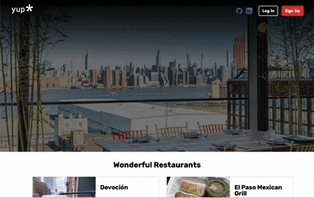
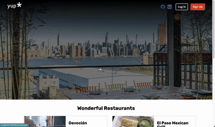
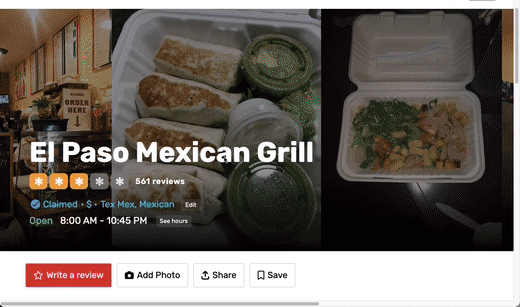

# Welcome to Yup.


Yup is a clone of Yelp.com. It allows users to browse local businesses and leave reviews.

Live deployment on [render.com](https://yup-z7t1.onrender.com/). Please wait up to 60 seconds for render.com to load page - thanks for waiting, future updates will include acceptable loading times.

# Technologies

#### Backend: Ruby on Rails

#### Frontend: React/Redux

#### Database: PostgreSQL

#### Design and Styling: HTML and CSS

#### Image hosting: AWS S3

# Key Features

### User Auth

- Users can login or signup for an account
- Login as a demo user
- Errors are styled and do not persist

&nbsp;

&nbsp;

### Create, Edit, and Delete Reviews

- if a user is logged in, they may:

  - create a review through the new review form

&nbsp;

&nbsp;

- update their own reviews through the edit form, linked to in the review displayed in the business (show) page
- delete a review, also through the edit form

&nbsp;

&nbsp;

- if a user is not logged in, all reviews are visible, but not editable.
  &nbsp;

### Splash / Business Index / Business Show

- Splash page with nav bar containing login links
- Simple list of businesses, click to navigate to show page
  &nbsp;

# React Mysteries

The biggest challenge for me was navigating the several asynchronous functions called through each stack, through multiple files. A simple example of my inconsistent implementation of this logic:

- Here is a link component which throws a `cannot read undefined` error unless I place a ternary conditional, for it to load an empty string/target on default.
- Following it is a link component from the `IndexPage`, in which no conditional is necessary for the business object to load.

&nbsp;
`components/EditReviewForm`

```js
<h3>
  Edit Review for <Link to={business ? `/businesses/${business.id}` : "/"}>{`${
    business ? business.name : ""
  }`}</Link>
</h3>
```

&nbsp;

&nbsp;
`components/IndexPage`

```js
<div className="card-image">
  <Link to={`/businesses/${business.id}`}>
    
  </Link>
</div>
```

&nbsp;

# Upcoming / Bonus Features

- Search bar on home page
- Proper styling for review CRUD functionality:
  - create link redirects to login page if user is not logged in
  - edit/delete link is only visible if the review belongs to logged-in user
- User show/profile page, with links to their reviews
- Splash page displays featured businesses or reviews, rather than an index of businesses
- download yelp api response, to reformat and seed a larger resource
  \_\_

# See you soon!

Thank you for checking out Yup. May the Schwartz be with you.

&nbsp;
`ER 2022`
